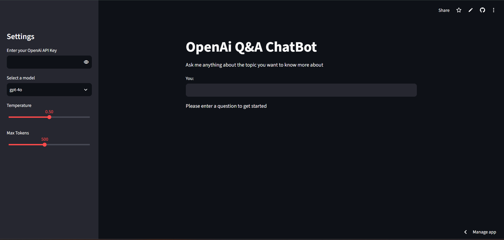
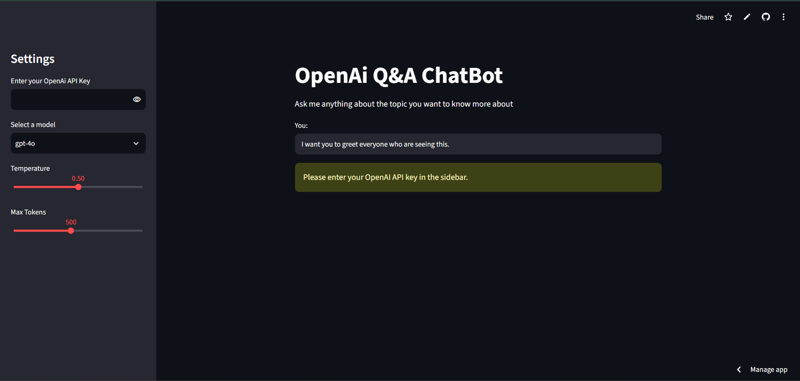
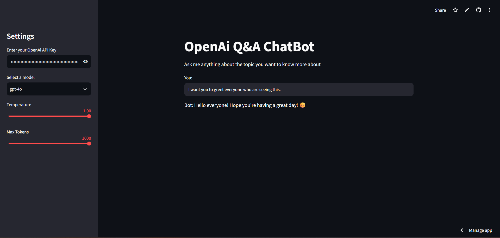

# CHATBOT using OPENAI and OLLAMA

Interactive Q&A chatbots built with **LangChain** and **Streamlit**.

| App | Backend | Where it runs |
| --- | --- | --- |
| OpenAI ChatBot | OpenAI API (`gpt-4o`, `gpt-4-turbo`, `gpt-4`) | Local or [Streamlit Community Cloud](https://streamlit.io/cloud) |
| Ollama ChatBot | Local Ollama models (`gemma2`, `phi3`, `mistral`, `deepseek-r1`) | Local only (requires [Ollama](https://ollama.com)) |

---

## Demo

### Interface



### Input



### Output



---

## Project structure

```text
1-Q&A ChatBot/
├── 1-OpenAI_ChatBot/
│   └── app.py                 # OpenAI + Streamlit Q&A app
├── 2-Ollama_ChatBot/
│   └── main.py                # Ollama + Streamlit Q&A app
├── IMAGES/
│   ├── Interface.png          # App UI screenshot
│   ├── Input.png              # Sample user input
│   └── Output.png             # Sample bot response
├── .env.example               # Template for optional env vars (no secrets)
├── .gitignore
├── LICENSE
├── README.md
└── requirements.txt
```

---

## Features

- Clean Streamlit UI for asking questions and viewing answers
- OpenAI model selection with temperature and max-token controls
- API key entered in the sidebar (not hard-coded in source)
- Optional LangSmith tracing via environment variables
- Local Ollama support for offline / private inference

---

## Prerequisites

- Python 3.10+
- For OpenAI app: an [OpenAI API key](https://platform.openai.com/api-keys)
- For Ollama app: [Ollama](https://ollama.com) installed, running, and models pulled

---

## Setup

1. **Clone the repository**

```bash
git clone https://github.com/kashyapsundaragiri/CHATBOT-using-OPENAI-and-OLLAMA.git
cd CHATBOT-using-OPENAI-and-OLLAMA
```

2. **Create and activate a virtual environment**

```bash
# Windows
python -m venv venv
venv\Scripts\activate

# macOS / Linux
python -m venv venv
source venv/bin/activate
```

3. **Install dependencies**

```bash
pip install -r requirements.txt
```

4. **(Optional) Configure LangSmith tracing**

Copy the example env file and fill in your own values. **Do not commit real keys.**

```bash
# Windows
copy .env.example .env

# macOS / Linux
cp .env.example .env
```

Edit `.env`:

```env
LANGCHAIN_API_KEY=your_langsmith_api_key_here
```

---

## Run locally

### OpenAI ChatBot

```bash
streamlit run 1-OpenAI_ChatBot/app.py
```

1. Open the app in your browser (usually `http://localhost:8501`)
2. Paste your OpenAI API key in the sidebar
3. Choose a model and ask a question

### Ollama ChatBot

Pull a model (example):

```bash
ollama pull gemma2
```

Start the app:

```bash
streamlit run 2-Ollama_ChatBot/main.py
```

> **Note:** Ollama must be running on your machine. This app is not suitable for Streamlit Cloud hosting.

---

## Deploy (OpenAI app only)

1. Push your code to GitHub (this repo)
2. Go to [Streamlit Community Cloud](https://share.streamlit.io/)
3. Deploy with:
   - **Main file path:** `1-OpenAI_ChatBot/app.py`
   - **Python dependencies:** `requirements.txt`
4. Users enter their OpenAI API key in the sidebar at runtime

Optional secrets (LangSmith only) in Streamlit Cloud → **Settings → Secrets**:

```toml
LANGCHAIN_API_KEY = "your_langsmith_api_key_here"
```

**Never** put your OpenAI or LangSmith keys in the README, screenshots, or committed files.

---

## Security

- `.env` is ignored by Git — keep real credentials there locally only
- Use `.env.example` as a safe template for collaborators
- Prefer entering the OpenAI key in the Streamlit sidebar rather than storing it in the repo
- Rotate any key that may have been exposed

---

## Tech stack

- [Streamlit](https://streamlit.io/) — UI
- [LangChain](https://www.langchain.com/) — prompt + chain orchestration
- [OpenAI](https://openai.com/) — cloud LLMs
- [Ollama](https://ollama.com/) — local LLMs
- [python-dotenv](https://pypi.org/project/python-dotenv/) — local env loading

---

## License

This project is licensed under the [MIT License](LICENSE).
